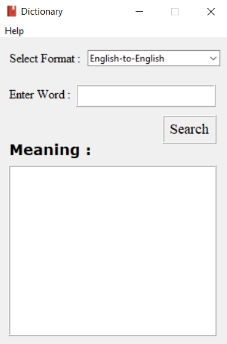

# Python-Dictionary [](https://forthebadge.com)

<br>
A Dictionary GUI App Made Using Python 3.9.0 .
Hope You Will Like It and you can also use the code to make your own version.

>### To Run, simply double click on the **dictionary_gui.exe**.
## Requirements
1.  PyDictionary
2.  englisttohindi
3.  tkinter

---

### Installing The PyDictionary Module:
* For Linux: Open Terminal then type ```pip3 install PyDictionary```
* For Windows: Open CMD, then type ```pip install PyDictionary```

### Installing The englisttohindi Module:
* For Linux: Open Terminal then type ```pip3 install englisttohindi```
* For Windows: Open CMD, then type ```pip install englisttohindi```

---
## Demo

